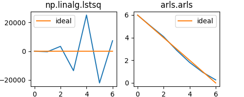

# ARLS: Automatically Regularized Linear System Solver

Arls is intended for use in solving linear systems, `Ax=b`, which other solvers 
may not be able to handle. Ill-conditioning is the usual reason for people to seek
alternative solvers such as `arls()`. In addition, `arls()` has a rich set of 
constraints which can be useful in solving both difficult and easy systems.

All these solvers apply to any shape of the matrix, `A`. That is, the 
system can have more rows than columns (over-determined), or the same number
of rows and columns (square), or fewer rows than columns (under-determined). And the matrix
`A` can be full rank, or have near zero singular values, or exactly zero singular 
values of any number.

Please see the in-code comments for details of calls and returns, including example applications for each routine.

Our primary solver is:

```python
from arls import arls
x = arls(A, b)
```

If you need to solve many systems with the same matrix, `A`, but different `b` vectors, use:

```python
from arls import arlsusv
x = arlsusv(A, b, U, S, Vt)[0]
```

See details in the code comments for how to get `U`, `S`, `Vt`.

If you need the solution to be constrained to be non-negative, use:

```python
from arls import arlsnn
x = arlsnn(A, b)
```
    
If you need to add constraint equations which must be satisfied exactly (such as
"the sum of the solution elements must be 100.0") then put those equation in a 
separate system, `Ex == f` and call:

```python
from arls import arlseq
x = arlseq(A, b, E, f)
```

If you need to add inequality constraints, such as `x1 + x2 >= 1.0` then 
put those equations in a separate system, `Gx >= h` and call:

```python
from arls import arlsgt
x = arlsgt(A, b, G, h)
```
    
If you need both equality and inequality constraints, use

```python
from arls import arlsall
x = arlsall(A, b, E, f, G, h) 
```

You can also constrain the shape of the solution with

```python
from arls import arlshape
x = arlshape(A, b, nonneg, slope, curve)
```

You can constrain the solution to be 

1. nonnegative; and/or 
2. monotonically non-decreasing (i.e., rising) or monotonically non-increasing (i.e., falling); and/or 
3. concave upward (like `y = x*x`) or concave downward.

Examples: 

```python
x = arlshape(A, b, 1, 1, 0)  # will force x to be nonnegative and rising.
x = arlshape(A, b, 0, -1, 1)  # will force x to be falling and concave up.
```

See details in the code comments.
    

## Example

This example is given in the Matlab version of ARLS: [ARLS v2](https://de.mathworks.com/matlabcentral/fileexchange/130259-arls-automatically-regularized-least-squares).


```python
import numpy as np
import scipy
from arls import arls

# Hilbert matrix:
order = 7
A = scipy.linalg.hilbert(order)

# ideal solution:
x = np.arange(order)[::-1]

# Add noise
np.random.seed(0)
b = A @ x + np.random.normal(scale=0.0001, size=(order, ))

# Using least squares solver:
x_ls, _, _, _ = np.linalg.lstsq(A, b, rcond=None)
# Using arls:
x_arls = arls(A, b)
```




## Origin of the code and Matlab version

This repository was created from the source code of arls version 1.0.2 published at [pypi.org](https://pypi.org/project/arls/).

Rondall E. Jones published a new version in 2023 for Matlab only at the [Matlab File Exchange](https://de.mathworks.com/matlabcentral/fileexchange/130259-arls-automatically-regularized-least-squares).
The Matlab version was also presented in a [blog entry by Cleve Moler](https://blogs.mathworks.com/cleve/2023/06/16/arls-automatically-regularized-least-squares/).

There is also some more information on [Rondall E. Jones' website](http://www.rejtrix.net/), for example a copy of his PhD thesis.

